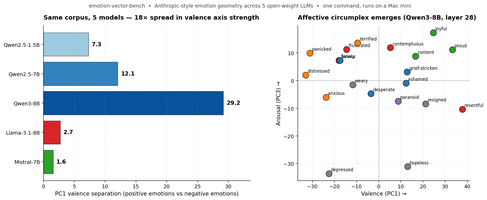

<div align="center">

# 🧠 emotion-vector-bench

**Anthropic-style emotion-vector geometry, on any open-weight LLM, in one command.**

[](LICENSE)
[](requirements.txt)
[](https://transformer-circuits.pub/2026/emotions/index.html)
[](docs/CROSS_MODEL_FINDINGS.md)
[](docs/HARDWARE_NOTES.md)



</div>

---

## What is this?

[Anthropic's April 2026 paper](https://transformer-circuits.pub/2026/emotions/index.html) showed that emotion concepts live as **linear directions in a model's residual stream** — directions that reproduce the human "affective circumplex" (valence × arousal) and influence the model's behavior. They proved it on closed Sonnet 4.5.

This repo lets you reproduce their methodology on any open-weight LLM with **one command**:

```bash
pip install -r requirements.txt
python code/run_bench.py --model Qwen/Qwen3-8B
# 75 minutes later → results/qwen3-8b/REPORT.md
```

Anthropic published the *recipe* but not the *data*. We provide:
- **The corpus** (3,000 stories + 50 neutral dialogues + 10 implicit-emotion scenarios — version-controlled, frozen, swappable)
- **A unified 6-stage pipeline** that runs on a Mac mini
- **Statistical rigor** Anthropic didn't formalize (bootstrap CIs, permutation tests, linear probe accuracy)
- **Reference results** across 5 open-weight models so you can compare your model to ours

---

## What you get when you run it

```
results/{model_slug}/
├── REPORT.md                     ← human-readable synthesis (this is what you read)
├── activations.npz                ← raw residual-stream activations on the corpus
├── raw_vectors.npz                ← 20 emotion vectors per layer
├── denoised_vectors.npz           ← PCA-denoised emotion vectors
├── validation_results.json        ← cosine clustering + PCA + cross-layer stats
├── probe_results.json             ← probe accuracy + bootstrap CIs + permutation p-values
├── arousal_results.json           ← affective circumplex (valence × arousal)
├── implicit_emotion_results.json  ← implicit-emotion scenario test
└── plots/
    ├── cosine_layer_*.png         ← cluster heatmaps
    ├── pca_layer_*.png            ← 2D PCA scatter
    └── circumplex_layer_*.png     ← affective circumplex (e.g. above)
```

Sample `REPORT.md` excerpt:

> ## 2. Probe accuracy, bootstrap CIs, and permutation tests
> Linear probe (logistic regression, 5-fold CV) trained on activations to predict emotion (1 of 20). Chance: 0.050
>
> | Layer | Probe acc | × chance | Diff CI | Permutation p |
> |---|---|---|---|---|
> | layer_28 | 0.905 ± 0.008 | 18.1× | [0.199, 0.225] | 0.000 |

---

## Reference results (5 models)

| Model | Probe acc | PC1 valence | Arousal sep | Implicit top-3 | Cross-layer |
|---|---|---|---|---|---|
| Qwen2.5-1.5B-Instruct | 89.7% | 7.30 | 6.20 | 20% | 0.962 |
| Qwen2.5-7B-Instruct | 91.8% | 12.06 | 9.84 | 60% | 0.961 |
| **Qwen3-8B** | 91.0% | **29.19** | **23.19** | 40% | **0.980** |
| Llama-3.1-8B-Instruct | **92.1%** | 2.71 | 1.70 | **60%** | 0.987 |
| Mistral-7B-Instruct-v0.3 | 91.6% | 1.57 | 1.14 | 50% | 0.987 |

**Permutation tests:** p < 0.001 across all models, all layers. The cluster signal is real, not noise.

**Headline finding:** all five models pass the basic geometry tests at 91-92% probe accuracy on 20-way emotion classification (chance 5%). But the *organization* of emotion is dramatically different — Qwen3-8B has 18× cleaner valence axis than Mistral, while Llama and Mistral have *tighter* within-cluster cohesion than the Qwen family. **Two valid geometric profiles, both encoding emotion richly, organized differently.** Full writeup: [`docs/CROSS_MODEL_FINDINGS.md`](docs/CROSS_MODEL_FINDINGS.md).

---

## How the pipeline works

| Stage | Script | What it does | Time on M4 Pro 7B |
|---|---|---|---|
| 1 | `extract.py` | Residual-stream activations on 3050 corpus stimuli | ~50 min |
| 2 | `compute_vectors.py` | Mean-of-means emotion vectors + PCA denoise | 30 sec |
| 3 | `validate.py` | Cosine clustering, PC1 valence, layer stability | 1 min |
| 4 | `probe_accuracy.py` | Linear probe + bootstrap CIs + permutation tests | 5 min |
| 5 | `arousal_axis.py` | Affective circumplex (valence × arousal) | 30 sec |
| 6 | `implicit_emotion_test.py` | Concept-vs-word check via implicit scenarios | 2 min |
| → | `generate_report.py` | Synthesize per-model REPORT.md | <1 sec |

Each stage is also a standalone script. You can run individual stages or skip extraction with `--skip-extraction` if you've already got activations.

---

## Repository structure

```
emotion-vector-bench/
├── README.md                     ← this file
├── METHODOLOGY.md                ← deep methodology + caveats
├── LICENSE                       ← MIT
├── requirements.txt
├── corpus/                       ← frozen stimulus, version-controlled
│   ├── emotions.json             ← 20 emotions w/ cluster labels
│   ├── topics.json               ← 30 topics across 6 domains
│   ├── stories/{emotion}.jsonl   ← 20 files × 150 stories each
│   ├── neutral_dialogues.jsonl   ← 50 emotionless dialogues for PCA denoise
│   └── implicit_scenarios.jsonl  ← 10 scenarios for the implicit-emotion test
├── code/
│   ├── run_bench.py              ← ★ main entry point
│   ├── extract.py
│   ├── compute_vectors.py
│   ├── validate.py
│   ├── probe_accuracy.py
│   ├── arousal_axis.py
│   ├── implicit_emotion_test.py
│   ├── generate_report.py
│   └── compare_models.py
├── docs/
│   ├── CROSS_MODEL_FINDINGS.md   ← full synthesis writeup
│   └── HARDWARE_NOTES.md         ← Mac MPS gotchas (read if running on Apple Silicon)
└── results/
    ├── _hero.png
    ├── _comparison.png
    └── {model_slug}/             ← per-model results (5 included)
```

---

## Why this exists

Anthropic published the *recipe* (prompt template + methodology) but not the *data*. Every researcher wanting to test emotion-vector geometry on their model has been:

1. Generating their own corpus (~6 hours of agent time + $50-100 in API costs)
2. Producing non-comparable results (everyone's stories are different)
3. Re-implementing the methodology from a 130-page paper

This repo:
- **Removes the corpus generation step.** 3,050 stimuli, all version-controlled.
- **Standardizes the stimulus.** Cross-model comparisons are apples-to-apples.
- **Adds statistical rigor** Anthropic didn't formalize: bootstrap CIs, permutation tests, probe accuracy as a comparable single number per model.
- **Documents the Mac-specific gotchas** (MPS allocator quirks, fp16 vs bf16, checkpointing) so you don't re-discover them.

---

## Cite

If this saved you compute or made your work easier, cite us:

```
emotion-vector-bench: A standardized corpus and reproducible recipe for testing
emotion-vector geometry across open-weight language models. 2026.
https://github.com/mufxio/emotion-vector-bench
```

## Source paper

Sofroniew, Kauvar, Saunders, et al. "Emotion Concepts and their Function in a Large Language Model." *Transformer Circuits Thread*, April 2026. https://transformer-circuits.pub/2026/emotions/index.html

## License

MIT. Take it, fork it, extend it.
